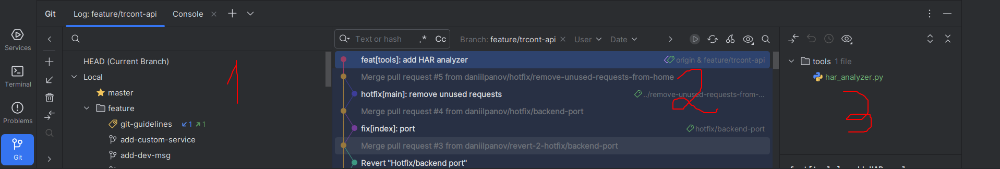

# Возможности JetBrains IDE в работе с Git
## Просмотр веток (git log)
В меню слева (обычно, в нижней его части) есть кнопка для открытия просмотра веток (подсвечена)

Нажав на эту кнопку, у Вас открывается панель с ветками. Если Вы хотите посмотреть историю коммитов в одной из них, просто нажмите на неё дважды.

1. Обзор веток
2. Обзор истории коммитов
3. Обзор выбранного коммита

Если на панели 3 дважды нажать на файл, откроется окно с diff этого файла.

Если нажать на f4, то можно перейти в сам файл для редактирования.

## Git rebase
Если необходимо выполнить Rebase, начиная с какого-то коммита, нужно:
1. Перейти на текущую ветку в меню выбора веток (rebase можно делать только из текущей ветки)
2. ПКМ на коммит -> Interactive rebase from here
3. В открывшемся окне можно перемещать, исправлять, удалять, переименовывать и объединять коммиты

Аналог `git rebase --continue` - зелёная кнопочка сверху в шапке окна. Рядом с ней находится красный крестик - аналог `git rebase --abort`.

Чтобы добавить изменённый файл в git index, достаточно нажать Ctrl+Alt+A или ПКМ -> Git -> Add.

При возникновении конфликтов IDE покажет уведомления, а конфликтные файлы автоматически исключатся из Git index.
Возможно, что при rebase у Вас высветится диалоговое окно со списком конфликтных файлов. В таком случае необходимо нажать на каждый файл два раза и разрешить конфликты.
При двойном нажатии у Вас высветится окно, разделённое на 3 части: текущие изменения, результат и применяемые изменения соответственно.
Вы должны нажимать на стрелочки для принятия тех или иных изменений. Можно также редактировать файл прямо на месте в центральной части. После resolve всех конфликтов высветится уведомление. Нажмите Далее.

Дополнительную информацию советую найти в статьях или официальной документации JetBrains.
